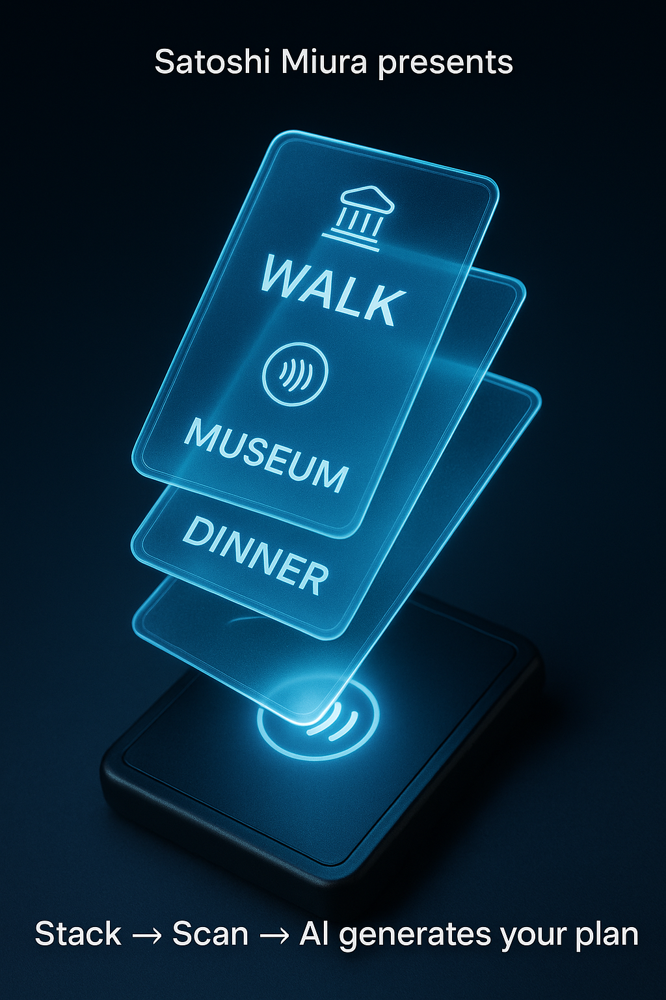

# CardAI-Interface: A Novel Physical UI for AI Systems

CardAI-Interface is an open innovation by Satoshi Miura. This concept proposes a futuristic interaction paradigm where users **stack physical IC/NFC cards like playing cards** and scan them with a reader. The AI (e.g., ChatGPT) then generates personalized plans based on the stacked commands.

## 🌟 Features
- 🃏 Physical cards as tangible commands
- 📲 Stack → Scan → AI generates plans
- 🌱 Open Source (MIT License)

## 📸 Demo

## 📖 Use Cases
- **Education**: Students stack subject cards to create study plans.
- **Tourism**: Travelers stack activity cards for AI-optimized itineraries.
- **E-Commerce**: Customers stack product cards for quick reordering.

## 📄 Technical Declaration
See [CardAI-Interface.pdf](docs/CardAI-Interface.pdf) for detailed documentation.

## 🏆 Author
**Satoshi Miura**

*"I hope this inspires future UI design." – Satoshi Miura*

## 📜 License
MIT License
